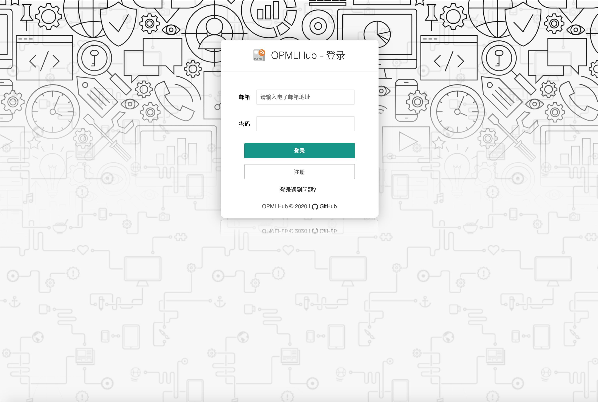
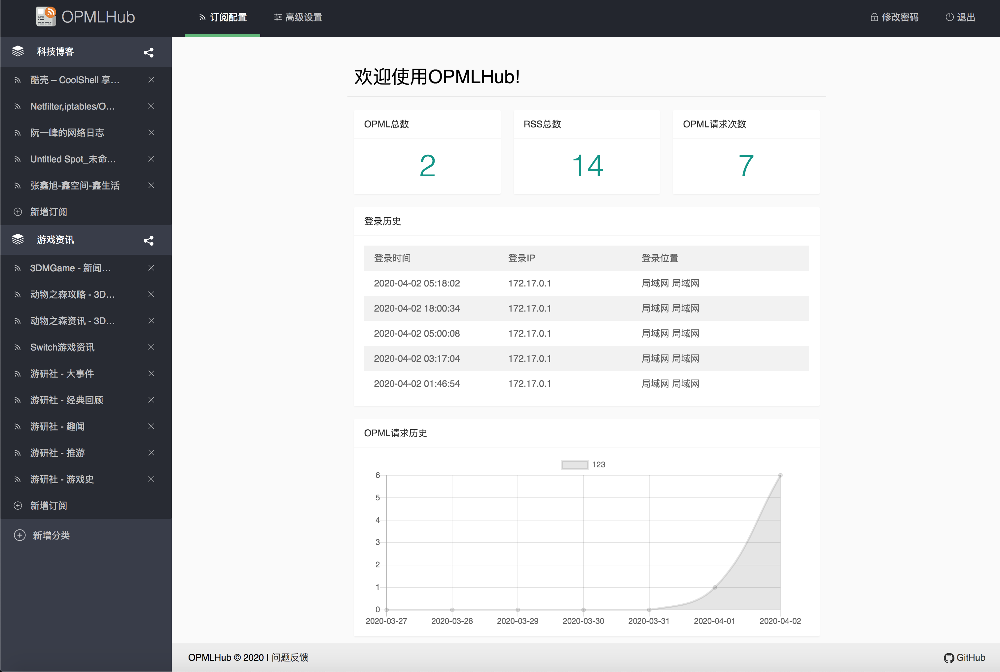
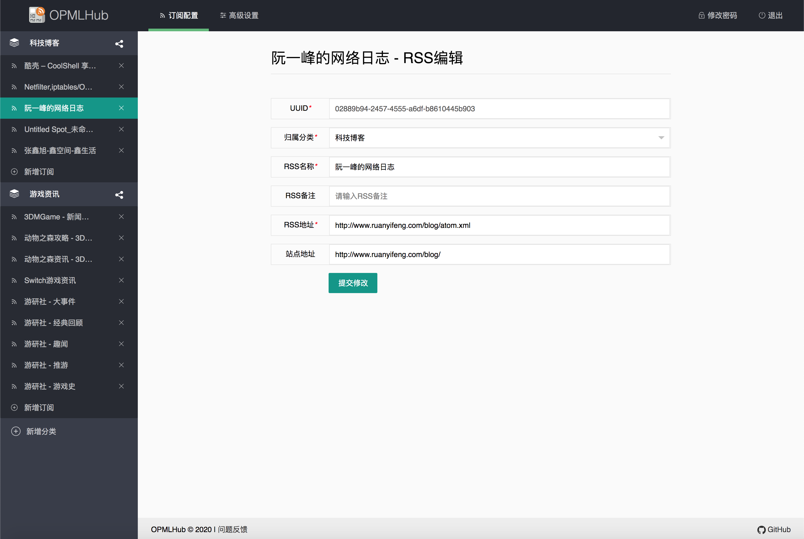
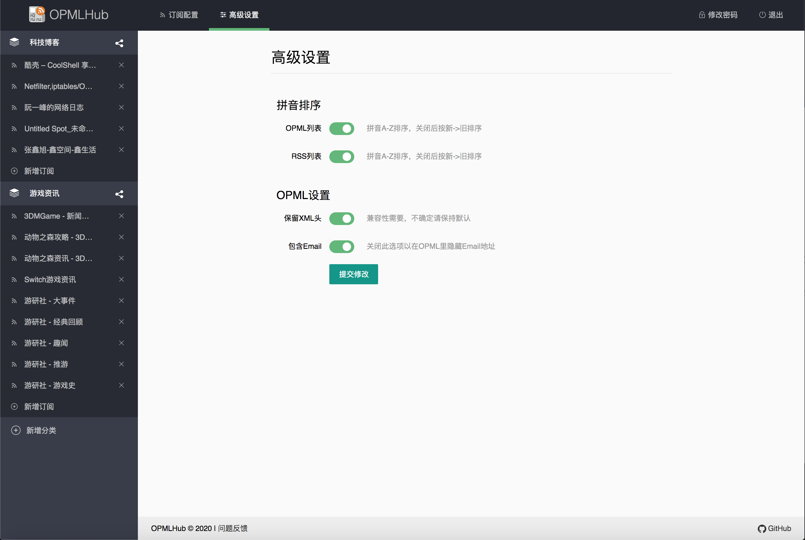

# OPMLHub

> RSS订阅批量管理新体验！

**本软件目前依旧处于内部测试阶段，将于四月中旬正式发布第一个版本(0.6.0)，如需现在体验，可访问https://opmlhub.lurenjia.in ，注册用户将会在第一个版本发布时收到提醒邮件！感谢支持！**

## 简介

这是一款能帮助RSS重度依赖用户便捷管理RSS订阅的软件。

本软件以OPML格式对RSS订阅进行归类，你可以在软件内建立OPML、添加RSS，然后获取一个形如`example.com/opml/c49f7b4a-dffb-436c-b020-ede937c052b1`的订阅链接。

接下来将这一链接粘贴到支持OPML订阅的客户端，即可订阅你所建立OPML中的所有RSS！

## 使用截图

### 登录/注册页面


### 首页


### RSS编辑页面


### 设置页面


## 功能

- 使用OPML对RSS进行聚合管理
- 支持各种OPML客户端
- 支持统计OPML链接请求数

## 部署

> 支持最低PHP版本为7.2，需安装Composer

1. 执行`git clone https://github.com/LuRenJiasWorld/OPMLHub.git`

2. `cd src`

3. `composer install` 安装所需依赖

4. 修改`src/app/Controllers/Config.php`中的各项配置

   | 配置项            | 含义                                               | 必填 |
   | ----------------- | -------------------------------------------------- | ---- |
   | $APP_ContactEmail | 联系邮箱，可让你的用户在遇到问题后使用该邮箱联系你 | 否   |
   | $SMTP_Host        | 发送邮件的SMTP服务器主机                           | 是   |
   | $SMTP_Port        | 发送邮件的SMTP服务器端口                           | 是   |
   | $SMTP_Encryption  | SMTP服务器加密模式（tls/ssl）                      | 是   |
   | $SMTP_User        | 发送邮件的用户名                                   | 是   |
   | $SMTP_Pass        | 发送邮件用户密码                                   | 是   |
   | $SMTP_Name        | 显示在收件人邮件中的发件人                         | 是   |
   | $DB_Host          | 数据库主机                                         | 是   |
   | $DB_Port          | 数据库端口                                         | 是   |
   | $DB_User          | 数据库用户                                         | 是   |
   | $DB_Pass          | 数据库密码                                         | 是   |
   | $DB_Database      | 数据库名称                                         | 是   |

5. 上传`sql/init.sql`到你的数据库中

6. 将`src`目录中的文件拷贝到你的Web服务器根目录，并配置相关权限

## 测试站点

> 测试站点不提供任何稳定性保障，如有大规模使用需求，建议自行部署

[https://opmlhub.lurenjia.in](https://opmlhub.lurenjia.in)

## 鸣谢

核心框架：[codeigniter4/CodeIgniter4](https://github.com/codeigniter4/CodeIgniter4)

UI：[sentsin/LayUI](https://github.com/sentsin/layui)

图表：[chartjs/Chart.js](https://github.com/chartjs/Chart.js)

其他：

- [overtrue/pinyin](https://github.com/overtrue/pinyin)

- [PHPMailer/PHPMailer](https://github.com/PHPMailer/PHPMailer)

- [zhuzhichao/ip-location-zh](https://github.com/zhuzhichao/ip-location-zh)

## 参与本项目

欢迎使用本软件，如果在使用过程中遇到问题，或有更好的方案，欢迎提交Issue或Pull Request。

## 赞助

如果你觉得本项目对你有帮助，请你考虑赞助本项目！


[PayPal](https://www.paypal.me/lurenjia)

## LICENSE

`MIT License`

```
MIT License

Copyright (c) 2020 OPMLHub

Permission is hereby granted, free of charge, to any person obtaining a copy
of this software and associated documentation files (the "Software"), to deal
in the Software without restriction, including without limitation the rights
to use, copy, modify, merge, publish, distribute, sublicense, and/or sell
copies of the Software, and to permit persons to whom the Software is
furnished to do so, subject to the following conditions:

The above copyright notice and this permission notice shall be included in all
copies or substantial portions of the Software.

THE SOFTWARE IS PROVIDED "AS IS", WITHOUT WARRANTY OF ANY KIND, EXPRESS OR
IMPLIED, INCLUDING BUT NOT LIMITED TO THE WARRANTIES OF MERCHANTABILITY,
FITNESS FOR A PARTICULAR PURPOSE AND NONINFRINGEMENT. IN NO EVENT SHALL THE
AUTHORS OR COPYRIGHT HOLDERS BE LIABLE FOR ANY CLAIM, DAMAGES OR OTHER
LIABILITY, WHETHER IN AN ACTION OF CONTRACT, TORT OR OTHERWISE, ARISING FROM,
OUT OF OR IN CONNECTION WITH THE SOFTWARE OR THE USE OR OTHER DEALINGS IN THE
SOFTWARE.
```

